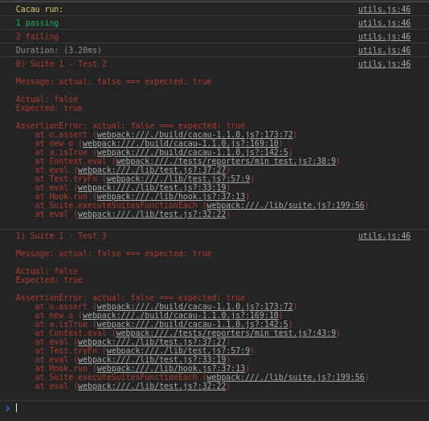

# Cacau

<p align="center">
  
</p>

## Test API in JavaScript.

### How to use Cacau

1 - First you must download the Cacau:

Using npm install

```shell
npm install cacau
```
Using CDN:

```html
<script src="https://unpkg.com/cacau@2.0.0/build/cacau-2.0.0.js"></script>
```
2 - You need to import the Cacau into your project:

```javascript
import 'cacau';
//or
require('cacau');
```
3 - You also have to choose the interface and the reporter that you want to use:

```javascript
cacau.ui('NewTdd');
cacau.reporter('Min');
//or
cacau.ui('NewTdd').reporter('Min');
```
4 - Write your tests (I chose the interface "NewTdd", see [#Interfaces](https://github.com/perdugames/cacau#interfaces) to see other interfaces available):

```javascript
suite('Suite 1', function() {
      
    test('Suite 1 - Test 1', () => {
        isTrue(true);
    });
    
    suite('Suite 2', function() {
    
        test('Suite 2 - Test 1', () => {
            isTrue(true);
        });
    
    });
    
});
```
The Cacau already comes with an assertion library you can use, check [#API](https://github.com/perdugames/cacau#api) for assertion functions available, but you can also use another assertion library like ChaiJS for example.

```javascript
suite('Suite 1', function() {
      
    test('Suite 1 - Test 1', () => {
        expect(1).to.equal(2);
    });
    
    suite('Suite 2', function() {
    
        test('Suite 2 - Test 1', () => {
            isTrue(true);
        });
    
    });
    
});
```
### Hooks

There are 4 types of hook in Cacau, they follow the order of execution presented below:

beforeAll - before all tests
beforeEach - before each test
afterEach - after each test
afterAll - after all tests

Cocoa hooks as well as suites can be nested, that is, if there is a suite within a suite, the hooks in the parent suite will also run on the child suite tests. Example:

```javascript
suite('Suite 1', function() {
    let x = 0;

    beforeEach(function() {
        x = 0;
    });
      
    test('Suite 1 - Test 1', () => {
        x++;
        actualEqualExpected(x, 1);
    });
    
    suite('Suite 2', function() {
    
        beforeEach(function() {
            x++;
        });
    
        test('Suite 2 - Test 1', () => {
            x++;
            actualEqualExpected(x, 2);
        });
    
    });
    
    test('Suite 1 - Test 2', () => {
        x++;
        actualEqualExpected(x, 1);
    });
    
});
```

Above in Test 1 of Suite 2, both beforeEach will run, BeforeEach from Suite 1 will run before Suite 2 beforeEach. You can also give a description for the hooks if you want:

```javascript
suite('Suite 1', function() {
    let x = 0;

    beforeEach('beforeEach Suite 1', function() {
        x = 0;
    });
      
    test('Suite 1 - Test 1', () => {
        x++;
        actualEqualExpected(x, 1);
    });
    
});
```
### Async Test

You can test the asynchronous code in Cacau easily just by passing a "done" function to the test function as shown below:

```javascript
suite('Suite 1', function() {
      
    test('Suite 1 - Test 1', (done) => {
        done();
    });
    
    test('Suite 1 - Test 1', (done) => {
        done(() => isTrue(true));
    });
    
});
```
See above, you can pass as an argument to "done", you can also pass an error as an argument to "done", perhaps this is the only advantage of Cacau in relation to other frameworks that do not support passing assertion functions as argument "done," like Mocha. Mocha inspired me enough to create Cacau, I studied his code a lot, and I recommend this framework, it has a well organized code, compared to Mocha, Cacau has more disadvantages than advantages.

### Timeout

Cacau timeouts can be applied to tests, suites, or hooks, tests inherit their father's timeout, unless you set up a test timeout directly. Here's an example:

```javascript
suite('Suite 1', function() {
    this.timeout(1);
    
    test('Suite 1 - Test 1', function() {
        let i = 0;
        while(i < 10000000) { i++; }
        isTrue(true);
    });
    
    test('Suite 1 - Test 2', () => {
        this.timeout(30000000);
        let i = 0;
        while(i < 10000000) { i++; }
        isTrue(true);
    });

});
```
Above Test 1 inherits the timeout set to 1 from the parent and will fail with the following error "TimeoutError: Time(1) extrapolated!" While Test 2 reconfigured its timeout to 30000000 and passes.

### Only and Skip

Cacau "only" and "skip" functionality work by following 4 precedence rules:

1 - Tests only have precedence of tests skip:

```javascript
Suite1 // run!
	test1
	test2.skip 
	suite2 // run!
		test1.only // run!
		test2
```
2 - Suites only have precedence of skip suites:

```javascript
Suite1.skip // run!
	test1
	suite2.only // run!
		test1 // run!
		test2 // run!

//or

Suite1.only // run!
	test1 // run!
	suite2.skip // run!
		test1 // run!
		test2 // run!

// or

Suite1.only // run!
	test1 // run!
	suite2.skip // run!
		test1.skip // run!
		test2 // run!
```
3 - Skip tests have precedence of suites only:

```javascript
Suite1.only // run!
	test1 // run!
	suite2 // run!
		test1.skip
		test2 // run!
```
4 - Tests only have precedence of skip suites:

```javascript
Suite1.skip // run!
	test1
	suite2 // run!
		test1.only // run!
		test2
```
### Interfaces

Cacau currently has two interfaces:

NewTdd:

```javascript
suite('Suite 1', function() {
    
    beforeAll(function() {
    
    });
    
    afterAll(function() {
    
    });
    
    beforeEach(function() {
    
    });
    
    afterEach(function() {
    
    });
      
    test('Suite 1 - Test 1', () => {
 
    });
    
});
```

Bdd:

```javascript
describe('Suite 1', function() {
    
    beforeAll(function() {
    
    });
    
    afterAll(function() {
    
    });
    
    beforeEach(function() {
    
    });
    
    afterEach(function() {
    
    });
      
    it('Suite 1 - Test 1', () => {
 
    });
    
});
```
### Reporters

Cacau currently has only one reporter:

Min:



#### Running Cacau in the Browser:

To use Cacau in the Browser you need to import the Cacau from some CDN or locally, below is shown using CDN:

```html
<!DOCTYPE html>
<html>
<head>
    <meta charset="utf-8">
    <meta name="viewport" content="width=device-width, initial-scale=1">
    <meta http-equiv="X-UA-Compatible" content="IE=edge">
    <title>Cacau</title>
</head>

<body>    
    <script src="https://unpkg.com/cacau@2.0.0/build/cacau-2.0.0.js"></script>
    
    <script> 
        cacau.ui('NewTdd').reporter('Min');

        suite('Suite 1', function() {

            test('Test 1', function() {
                isTrue(false);
            });

        });

        cacau.run();
    </script>
</body>
</html>
```   
## API

function **test(description, fn)**

function **suite(description, fn)**

function **mock(object)**

function **isTrue(value)**

function **isNotTrue(value)**

function **isFalse(value)**

function **isNotFalse(value)**

function **isUndefined(value)**

function **isNotUndefined(value)**

function **isNull(value)**

function **isNotNull(value)**

function **actualEqualExpected(actual, expected)**

function **actualNotEqualExpected(actual, expected)**

function **actualDeepEqualExpected(actual, expected)**