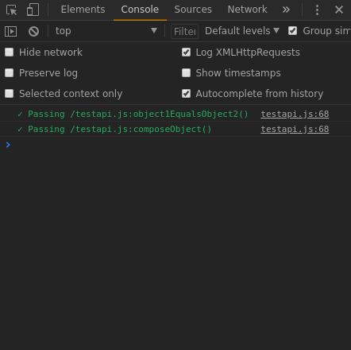
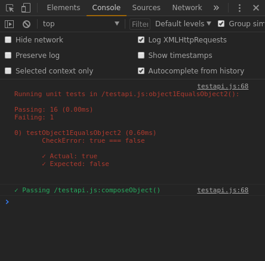

# Cacau

<p align="center">
  
</p>

## Test API in JavaScript(Client).

To use you can check the files **object1EqualsObject2_test.js** and **composeobject_test.js** where I test these two functions of TestAPI itself.

To call the files, you create a file, I called it **runtests.js**, you can give the name you want, as below:

#### runtests.js
```javascript
// UNITS
import './cacau/object1EqualsObject2_test';
import './cacau/composeobject_test';
```
And call import the "runtests.js" into your main file, as below:

#### main.js
```javascript
import './runtests.js';
// ...
```
Updating(F5) your browser will be able to see in the console the tests that have passed and those that have failed.

An example test that has passed:




An example test that has failed:




## API

Object **FIX**

function **CREATE_FIXTURE(function)**

function **TEST(fileName, function)**

function **TEST_F(fileName, function)**

function **CREATE_MOCK(object)**

function **CHECK_ACTUAL_EQUAL_EXPECTED(actual, expected)**

function **CHECK_ACTUAL_EQUAL_EXPECTED_OBJECT(actual, expected)**

function **CHECK_ACTUAL_DIFFERENT_EXPECTED(actual, expected)**

function **CHECK_ACTUAL_DIFFERENT_EXPECTED_OBJECT(actual, expected)**

***Note:*** 

*The "TEST" in the import of the files **object1EqualsObject2_test.js** and **composeobject_test.js** are alias for this same directory within my project, in a Webpack configuration. If you prefer can only reference "./testapi" if you are not using the same alias in the Webpack.*

