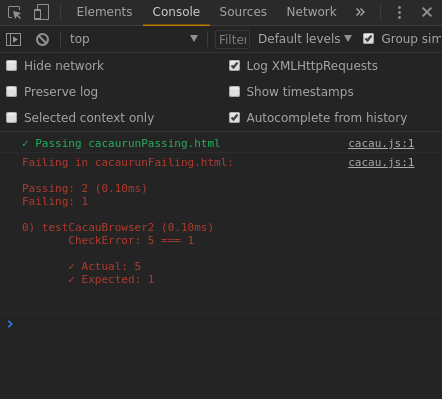

# Cacau

<p align="center">
  
</p>

## Test API in JavaScript(Client).

### How to use Cacau

The code below will show you how to use the API and also explains how to
The **TEST_F** receives as a first argument a String, and the second a function, where you must render the result of a CHECK function. May seem tricky at first, but it's quite simple. Look at the simple example below:

```javascript
TEST('/myFile.js',
      
    TEST_F('testAplusB', () => {
        const A = 1;
        const B = 1;
        const actual = plus(A, B);
        const expected = A + B;
        return CHECK_ACTUAL_EQUAL_EXPECTED(actual, expected);
    }),
);
```

We are checking if the "Plus()" function is acting as expected, we pass A and B to it that have a value of 1, and we expect it to return 2, we use **CHECK_ACTUAL_EQUAL_EXPECTED()** to do this verification (this function has that name because I got tired of having to check if the "current" parameter is the first or second parameter, my mind tends to dyslexia with those things, and I wasted time with it when I forgot or confused myself, so I decided change your name by informing the correct order of arguments).

It is possible to write several tests for the same file, because the **TEST** function receives as a second argument, as many test functions as you want (being limited only to how many arguments JavaScript allows you to pass, I'm not sure how many, but it should be enough) , the second argument uses the spread syntax "... testFunctions", so you can add your tests, passing more test functions that we call with **TEST_F**, see below:

```javascript
TEST('/myFile.js',
      
    TEST_F('test1', () => {
        // ...
        return CHECK_ACTUAL_EQUAL_EXPECTED(actual, expected);
    }),

    TEST_F('test2', () => {
        // ...
        return CHECK_ACTUAL_EQUAL_EXPECTED(actual, expected);
    }),

    // ...
);
```

Cacau has two ways to run your tests today. The first mode is by using a custom Webpack build, and the second mode is by calling Cacau and testing directly using the HTML script tags in your "runcacau.html". I'll show you what I'm saying below:

**How to use FIXTURE in Cacau:**

First create a FIXTURE function (you can call it as you want it), it must return an object, you can use that object in the test functions, but be careful with the references, use FIXTURE carefully, see example:

```javascript
import {TEST, TEST_F, FIXTURE, CHECK_ACTUAL_EQUAL_EXPECTED} from './tests/cacau.js';

const FIXTURE = () => {
    function Duckling(name) {
        this.name = name;
    }
    const fix = {
         duckling: new Duckling("Julio"),
         pos: { x: 0, y: 0 }
    };
    return fix;
};

TEST('testExample',
    TEST_F('testChangeDucklingName', (FIX) => {
        FIX.duckling.name = 'Matias'; 
        const ducklingName = FIX.duckling.name;

        return CHECK_ACTUAL_EQUAL_EXPECTED(ducklingName, 'Matias');
    }, FIXTURE),

    TEST_F('testPosIncrement', (FIX) => {
        const expectedPos = FIX.pos.x + 1;
        FIX.pos.x++;
        const actualPos = FIX.pos.x;

        return CHECK_ACTUAL_EQUAL_EXPECTED(actualPos, expectedPos);
    }, FIXTURE),

   TEST_F('testOnePlusOne', () => {
        const result = 0;

        const expected = result + 2;
    
        const result = 1 + 1;

        return CHECK_ACTUAL_EQUAL_EXPECTED(result, expected);
    })

);
```

#### Running the tests using a custom Webpack configuration:

We need to create a file in the root directory, called webpack.config.test.js webpack.config.test.js:

```javascript
const path = require("path");

module.exports = {
    entry: "./tests/executetests.js",
    output: {
        path: path.resolve(__dirname, "build/"),
        filename: "example_test.js",
    },
    resolve: {
        modules: [__dirname, "node_modules"],
        alias: {
          TESTS: path.resolve(__dirname, "tests")
        },
        extensions: ['.js']
    },
    module: {
        rules: [
            {
                test: /\.js$/,
                exclude: /(node_modules)/,
                use: {
                    loader: "babel-loader",
                    options: {
                        cacheDirectory: true,
                        presets: ["babel-preset-env"]
                    }
                }
            },
        ]
    }
};
```

Without fear, I will explain what he is, and what he is setting. In the webpack we can create several configuration files and call them in different compilation commands, for example, let's look at the lines below our file "package.json":

```json
"scripts": {
        "build": "webpack --mode production --config webpack.config.js",
        "develop": "webpack --mode development --watch --config webpack.config.dev.js"
    },
```

Note the --config tag, with it we can call different compilation files for each npm command.

Let's then create a new member in "script:" to compile our test execution file:

```json
"scripts": {
        "build": "webpack --mode production --config webpack.config.js",
        "develop": "webpack --mode development --watch --config webpack.config.dev.js",
        "test": "webpack --mode development --watch --config webpack.config.test.js"
    },
 ```
 
Now we have a new "test" member that will be called "npm run test", and it will compile our test execution file by calling our webpack configuration file "webpack.config.test.js". I kept the --watch tag to listen for the changes without having to run the "npm" command every time I need to run the tests. So any changes to the test code or implementation will be recognized by the webpack, which will re-compile and update automatically, so we just need to refresh the browser page to see what our test changes do.

The input file is "./tests/executetests.js" which is our file that will import all the tests that will run. And the output file name for "example_test.js".

We will now need to call this file generated by the webpack in our browser, for this we created the file "runcacau.html", follow the content of it below:

```html
<!DOCTYPE html>
<html>
<head>
    <meta charset="utf-8">
    <meta name="viewport" content="width=device-width, initial-scale=1">
    <meta http-equiv="X-UA-Compatible" content="IE=edge">
    <title>Cacau</title>
</head>

<body>
    <script src="../build/example_test.js"></script>
</body>
</html>
```

It is a very basic .html file, where we call with the script tag a single file generated by the webpack, which is our test execution file, so just call the file "runcacau.html" in your browser and you can see the test results on your console. An example of the file "executetests.js":

```javascript
import './unit/examplefiletest_test';
```
#### Running the tests using the HTML script tag:

There is also another way to run the tests with Cacau, we can call it in an HTML script tag, follow the example below:

```html
<!DOCTYPE html>
<html>
<head>
    <meta charset="utf-8">
    <meta name="viewport" content="width=device-width, initial-scale=1">
    <meta http-equiv="X-UA-Compatible" content="IE=edge">
    <title>Cacau</title>
</head>

<body>
    <script src="../build/all_tests.js"></script>
    <script src="./cacau.js"></script>
    <script>
        cacau.TEST("../build/all_tests.js",
            
            cacau.TEST_F("AllTests", () => {
                return CHECK_ACTUAL_EQUAL_EXPECTED(1, 1);
            })
        );
    </script>
</body>

</html>
```   
     
See the example files in the example directory of this repository for more details. 
Then you can use Cacau also in the CommonJS/AMD/ES2015 module, as in the Browser by calling in a script HTML tag.

An example test that has passed and failed:



## API

function **TEST(fileName, function)**

function **TEST_F(fileName, function)**

function **CREATE_MOCK(object)**

function **CHECK_ACTUAL_EQUAL_EXPECTED(actual, expected)**

function **CHECK_ACTUAL_EQUAL_EXPECTED_OBJECT(actual, expected)**

function **CHECK_ACTUAL_DIFFERENT_EXPECTED(actual, expected)**

function **CHECK_ACTUAL_DIFFERENT_EXPECTED_OBJECT(actual, expected)**
